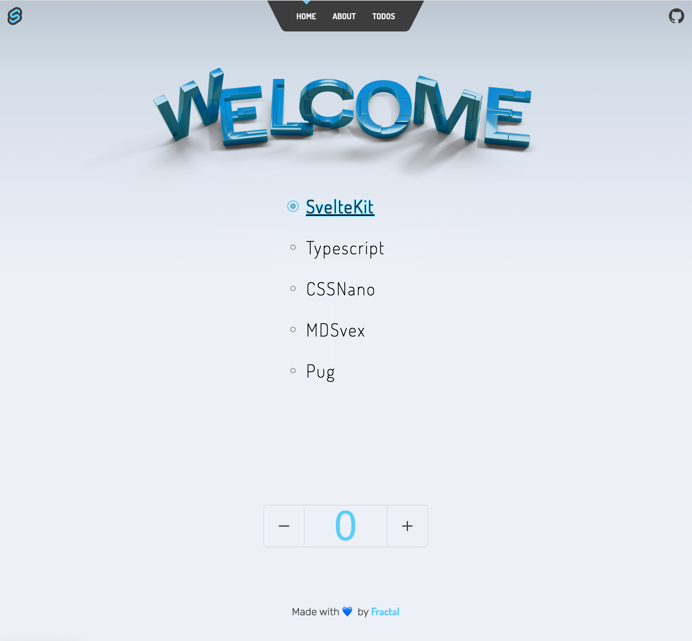

# Frackit

My personal [Sveltekit](https://kit.svelte.dev) starter template, powered by [`create-svelte`](https://github.com/sveltejs/kit/tree/master/packages/create-svelte).

<h5 align=center> 🚧 &nbsp; <em>work in progress</em> 🚧  </h5>

